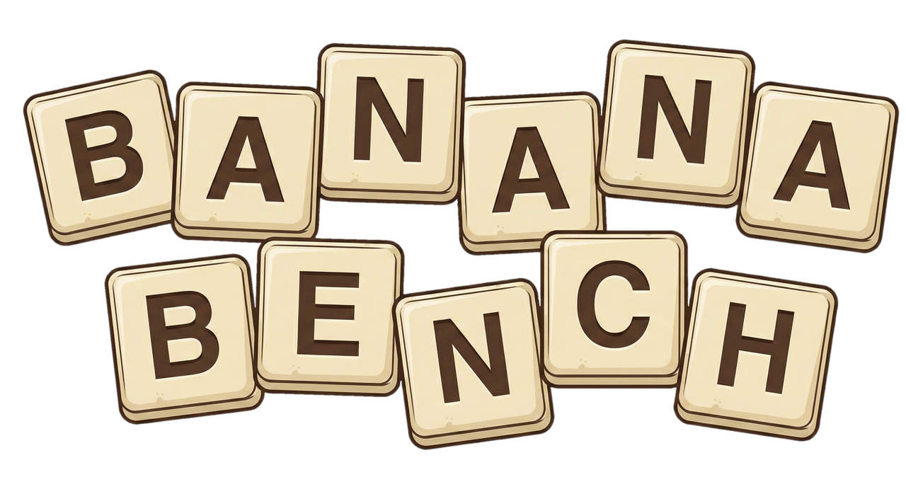
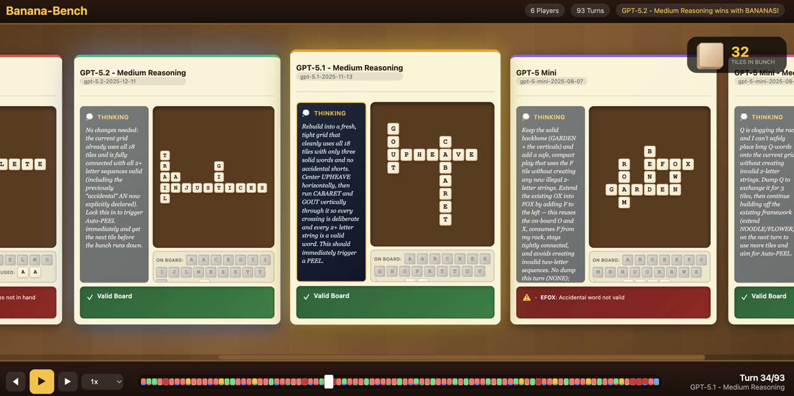

# Banana-Bench



A benchmark for evaluating Large Language Models through the game of Bananagrams. LLMs must build valid crossword-style boards using structured output formats, demonstrating spatial reasoning, constraint satisfaction, and multi-turn strategic decision-making.

### How it Works

1. **Setup**: Each LLM receives a starting hand of tiles (21 for 1-4 players)
2. **Turn Loop**: On each turn:
   - LLM receives current hand, game state, and feedback from previous turn
   - LLM generates a board specification
   - Board is validated against structure rules, grid conflicts, and dictionary
   - **Auto-PEEL**: If board is valid and uses all tiles, everyone draws one tile
   - **Auto-BANANAS**: If bunch is empty and board is valid, player wins!
3. **Actions**: Players can use `DUMP X` to exchange a difficult tile for three new ones
4. **End**: The first LLM to create a valid board using all their tiles when the bunch is empty wins the game!

## Setup and Install

### Requirements
- Python 3.13+
- [uv](https://github.com/astral-sh/uv) package manager

### Installation

```bash
# Clone the repository
git clone https://github.com/yourusername/banana-bench.git
cd banana-bench

# Install dependencies with uv
uv sync

# Set up your LLM API key (for OpenAI, Anthropic, etc.)
export OPENAI_API_KEY="your-api-key"
```

## Usage

### Configuration

Create a YAML config file to customize your benchmark:

**Example**
```yaml
max_turns: 500
seed: 42

players:
  - model: gpt-5.2-2025-12-11
    name: "GPT-5.2"
    temperature: 1

  - model: gpt-5.2-2025-12-11
    name: "GPT-5.2 - Medium Reasoning"
    temperature: 1
    reasoning_effort: medium
```

**Key Features:**
- Each player can have different model, temperature, and max_tokens
- Pass provider-specific kwargs (like Claude's `thinking` parameter)
- Mix and match any LiteLLM-supported parameters
- Optional custom names
- Number of players is automatically determined by the players list


### Kick Off

```bash
# Run a benchmark with the example config
uv run python -m src.main example_config.yaml

# Run with verbose output to see the game play out
uv run python -m src.main example_config.yaml --verbose

# Save results to a specific location
uv run python -m src.main example_config.yaml --output results/my_run.json
```

### Resuming Interrupted Runs

If a benchmark is interrupted (API quota limits, crashes, etc.), you can resume from where it left off:

```bash
# Resume from a saved result file
uv run python -m src.main --resume interrupted_run.json --verbose

# Resume and save to a specific output file
uv run python -m src.main --resume interrupted_run.json --output final_run.json
```

## Visualization



Banana-Bench includes an interactive HTML visualizer that lets you watch games play out turn-by-turn with animations and player insights.

### Generating Visualizations

**Generate during benchmark run:**
```bash
# Run benchmark and automatically create visualizer
uv run python -m src.main configs/example.yaml --visualize
```

**Generate from existing results:**
```bash
# Convert any results JSON to an interactive visualizer
uv run python -m src.visualize game.json

# Specify custom output location
uv run python -m src.visualize game.json --output my_viz.html
```

## Extras

### Validation System

The verifier checks boards through multiple stages:

1. **Parsing**: Board format must be correct
2. **Structure**: Letter matches, perpendicularity, index bounds
3. **Grid**: No overlapping letter conflicts
4. **Words**: All words must be in TWL dictionary
5. **Tiles**: Must use exactly the tiles in hand

**Cascading Errors**: The system filters downstream errors to show only root causes:
- Parsing errors hide all downstream validation
- Structural errors hide grid conflicts and accidental words
- Errors limited to 5 maximum with actionable tips

## Results

Benchmark results are saved as JSON files containing:
- Full configuration
- Turn-by-turn history with validations
- Complete conversation history for each player
- Final game state and outcome
- Timing information
- Per-turn and total token counts (prompt, completion, and total tokens)

## Acknowledgements

Thanks to [Michael Fogleman](https://github.com/fogleman) for providing the [Scrabble Tournament Word List](https://github.com/fogleman/TWL06) verification logic and data.

# Contributions

Contributions welcome! Feel free to submit an issue or documented PR.

Todo List
- Better validation of various models and providers
- Ranking and List
- Organizing codebase

## License

[MIT License](LICENSE)